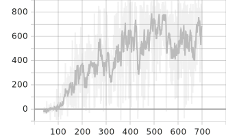

### Approach

I use the DQN family of algorithms and precisely a Double DQN with Dueling architecture, in order to train a Deep Reinforcement
Learning agent, in playing the Car-Racing environment. My approach is inspired by the guidelines presented in Deepmind's paper,
[Playing Atari with Deep Reinforcement Learning](https://arxiv.org/abs/1312.5602).

### Setup

Crete a new python 3.8 conda environment and install project dependencies with: 
    
    pip install -r requirements.txt -f https://download.pytorch.org/whl/torch_stable.html

GPU versions of pytorch packages are specified in requirements.txt as it was used in order
to speed up the training process. However, the implementation can be executed in CPU without 
modifications.

In order to execute the main script navigate to project folder:

    cd GATMachineLearningTest/car_racing

Then execute:

    python car_racing.py

In order to monitor training procedure and log the results, tensorboard is used. It can
be launched with the following command:

    tensorboard --logdir runs

_runs_ folder already contains a few experiments. When tensorboard is launched they will be 
depicted as well. 

A docker file is provided as well, which takes cares of the installation steps.
However, known issues in CarRacing env, concerning unexpected [popping windows](https://github.com/openai/gym/issues/137)
prevented the execution in a setting without a graph interface, like a docker container. 
Unfortunately, due to the limited time frame it was not possible to come up with a 
solution.

### Results

In runs folder there are the tensorboard logs. The most promising experiment achieved to 
increase its reward and reached even a score of 900 in many episodes. Below is graphical 
representation of reward per episode taken from tensorboard.

This outcome was achieved with a discount factor of 0.97. In the limited time available, a 
few more experiments were performed with different gamma values.

### Testing

A few test cases have been created, addressing the operations of the Memory class, which 
participates in the experience replay mechanism of the DQN algorithm.

### References 

[1] [Playing Atari with Deep Reinforcement Learning](https://arxiv.org/abs/1312.5602)